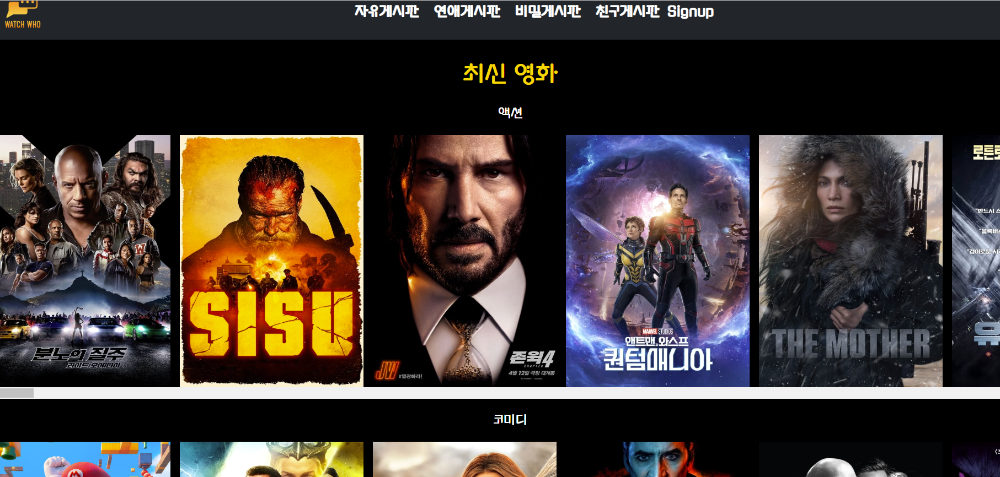

# PreView
## 홈페이지
<br><br><br>
## 영화 상세 정보
<br><br><br>
## 영화 리뷰
<br><br><br>
## 프로필 페이지
<br><br><br>
## 프로필 수정
<br><br><br>
## 자유게시판
<br><br><br>
## 비밀 게시판
<br><br><br>

# 개요
- 어플리케이션 이름 : Watch Who
  - Watch who -> 누구와 어떤 영화를 볼지 찾을 수 있는 커뮤티니 서비스
- TMDB에 api호출을 통해 영화 정보를 가져와서 사용
  - https://www.themoviedb.org/?language=ko
  - https://developer.themoviedb.org/docs

# 목적
- 영화를 장르별로 추천하고 영화의 상세 정보 및 리뷰를 볼 수 있음
- 목적에 따라 분류된 커뮤니티 게시판을 통해 유저간 소통 가능
- 유저의 프로필 페이지를 통해 자신을 표현하고 팔로우, 팔로잉을 통해 소통할 수 있게 함

# 어플리케이션 사용 방법
## 필수 설치 파일
- vscode
- django
- python 
- vue 
- javascript
- node.js
- splite


## back-server
1. 가상 환경 활성화 및 패키지 설치
```
python -m venv venv
source venv/scripts/activate
pip install -r requirements.txt
```
2. DB 생성
```
python manage.py makemigrations

python manage.py migrate
```
3. 서버 실행
```
python manage.py runserver
```

## front-server
1. npm 및 axios 라이브러리 설치
```
npm install

npm install axios
```
2. 서버 실행
```
npm run serve
```

## API 키 발급 및 사용
1. https://www.themoviedb.org/?language=ko 접속 후 api 키 발급
2. Movie Recommend Community/Back-server/.env 파일 내에 api 키 입력
3. Movie Recommend Community/front-server/.env 파일 내에 api 키 입력

``※ 발급 받은 키가 유출되지 않도록 주의할 것``
