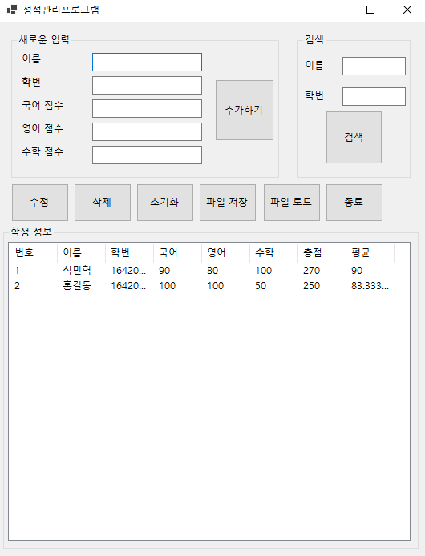

# Preview
## Main
   

# 성적관리 프로그램 기능 및 사용법
- 추가 : 이름, 학번, 점수에 해당하는 Box에 정보를 입력하고 '추가하기' 버튼을 클릭합니다.

- 수정 : 수정할 행을 클릭한 후 변경할 내용을 입력 box에 입력하고 '수정' 버튼을 클릭합니다.

- 삭제 : 삭제할 행을 클릭한 후 '삭제' 버튼을 클릭합니다.

- 파일 저장 : '파일 저장' 버튼을 클릭한 후 저장할 이름과 경로를 설정합니다.

- 파일 로드 : '파일 로드' 버튼을 클릭한 후 불러올 파일의 이름과 경로를 설정합니다.

- 종료 : '종료' 버튼을 클릭합니다.
